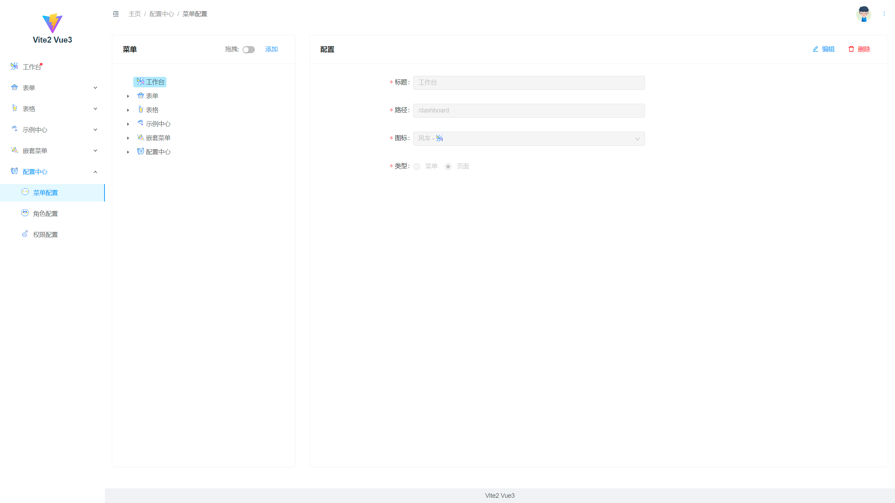
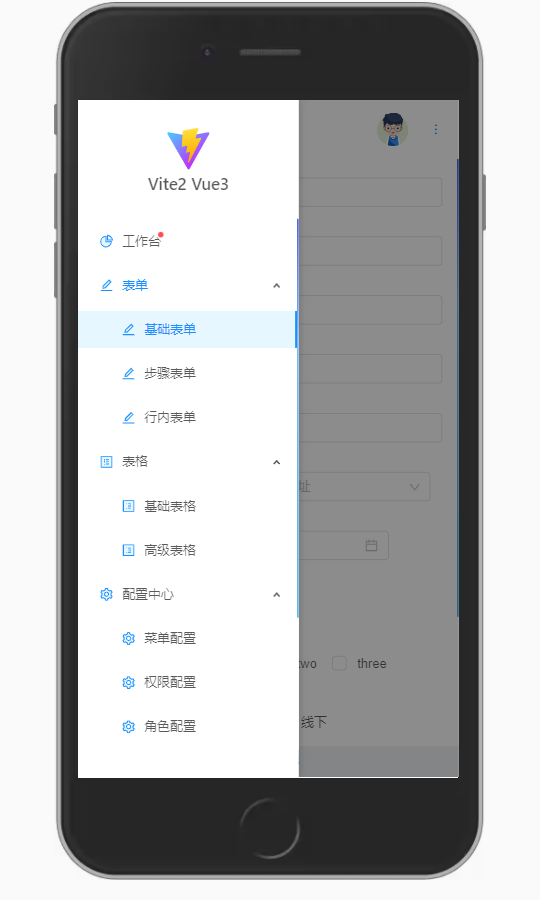
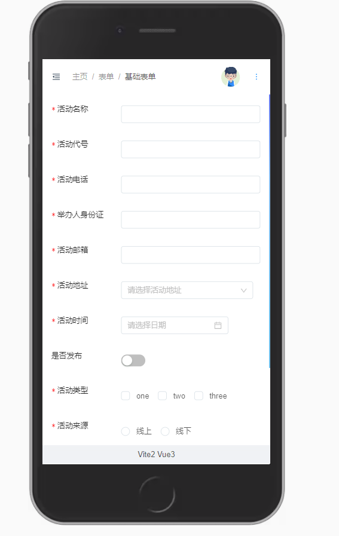

# Vite2Admin
#### Vite2 + Vue3.0 + ant-design 2.x

##### 目录树

```
├─public
└─src
    ├─api
    ├─assets
    │  ├─font
    │  ├─icon
    │  ├─img
    │  └─svg
    ├─components
    │  └─global
    │          aIcon.vue
    │          iconFont.js
    │          index.js
    ├─constants
    ├─directives
    ├─filters
    ├─hooks
    │      useCountDown.js
    │      useDeviceInfo.js
    │      useEchartSwipe.js
    │      useFullscreen.js
    │      useInterval.js
    │      useMouse.js
    │      useSize.js
    │      useTableRequest.js
    │      useWinResize.js
    ├─layout
    │      index.vue
    │      siderContent.vue
    │      subMenu.vue
    ├─router
    │  └─modules
    │  │  asyncRoutes.js
    │  │  index.js
    ├─store
    │  └─modules
    │  │  actions.js
    │  │  getters.js
    │  │  index.js
    │  │  mutations.js
    ├─styles
    │      global.less
    │      theme.less
    ├─utils
    │      auth.js
    │      index.js
    │      request.js
    │      validate.js
    └─views
    │  └─...more
    │  App.vue
    │  main.js
    │  permisson.js
│  .editorconfig
│  .env.development
│  .env.production
│  .env.staging
│  .gitignore
│  .prettierrc
│  index.html
│  package.json
│  README.md
│  vite.config.js
```

##### 全面使用 script setup 实验性功能😂

```vue
<template>
  <div class="siderContent">
    <div class="logo">
      
      Vite2 Vue3
    </div>
    <a-menu
      :selectedKeys="menuSelectedKeys"
      :openKeys="menuOpenKeys"
      theme="light"
      mode="inline"
      :default-selected-keys="[]"
      @click="handleCLick"
      @select="handleSelect"
      @openChange="openChange"
      class="g-scrollbar-y"
    >
      <template v-for="item in menuList">
        <a-menu-item v-if="!item.children" :key="item.key">
          <a-icon :type="item.icon" />
          <!-- <span>{{ item.title }}</span> -->
          <a-badge :dot="!item.show">
            {{ item.title }}
          </a-badge>
        </a-menu-item>
        <sub-menu v-else :key="item.key" :menu-info="item" />
      </template>
    </a-menu>
  </div>
</template>

<script setup>
import logo from '@/assets/svg/logo.svg'
import subMenu from './subMenu.vue'
import { computed, watchEffect } from 'vue'
import { useStore } from 'vuex'
import { useRouter, useRoute } from 'vue-router'
const Store = useStore()
const Router = useRouter()
const Route = useRoute()
const menuList = computed(() => {
  return Store.getters.menuList
})
const menuOpenKeys = computed(() => {
  return Store.getters.menuOpenKeys
})
const menuSelectedKeys = computed(() => {
  return Store.getters.menuSelectedKeys
})
const handleSelect = ({ item, key, selectedKeys }) => {
  Store.commit('menuInfo/SET_selectedKeys', selectedKeys)
}
const openChange = keys => {
  Store.commit('menuInfo/SET_openKeys', keys)
}
const handleCLick = ({ key }) => {
  Router.push({ path: key })
}
watchEffect(() => {
  const { matched: matchList } = Route
  const validList = matchList.filter(item => {
    return !item.meta.hide && item.path !== '/'
  })
  const [select, ...open] = validList.reverse()
  const selectedKeys = [select.path]
  const OpenKeys = open.map(item => item.path)
  handleSelect({ selectedKeys })
  openChange(OpenKeys)
})
</script>

<style scoped lang="less">
</style>

```

##### 图例







